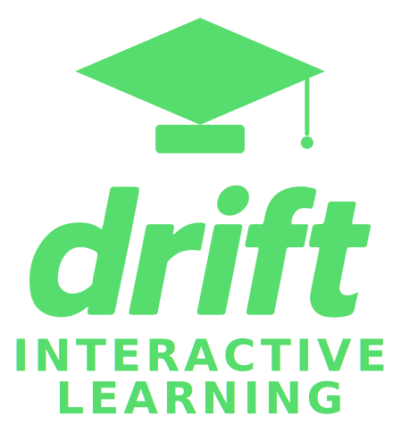

# Drift Interactive Learning 

Drift Interactive Learning is an adaptive, hands-on environment for exploring the Drift programming language. It focuses on practical skills, real-world patterns, and the parts of Drift that matter when building reliable software.
When you finish, you’ll know how to approach real problems the “Drift way”: breaking them down cleanly, handling errors with confidence, and writing logic that behaves exactly as you expect. You’ll build instincts that carry over to any language and make you a stronger engineer overall.
The full beginner path takes roughly two hours to complete, with each chapter designed to be short, focused, and easy to follow at your own pace. There’s no competition here — no cookies, scores, nor leaderboards. It’s an anonymous, restartable journey built to spark curiosity and help you discover the fun side of Drift programming.

---

## What this project provides

### **1. A guided, interactive tour of the Drift language**
Learners progress through Drift concepts step‑by‑step:
- values, refs, and mutability
- arrays and iteration
- Drift’s error‑edge model
- structs and mutation
- traits and generics
- SSA and MIR visualizations
- plugins and signed modules
- FFI and ABI behavior

Each concept is paired with explanations, examples, and hands‑on problem‑solving.

---

### **2. Adaptive learning paths**
The journey starts with a short yes/no questionnaire that gauges experience:

- total beginner  
- intermediate programmer  
- advanced systems developer  

Based on answers, the site chooses the right track:

- **Track A** — Beginner  
- **Track B** — Intermediate  
- **Track C** — Advanced  

This ensures no one is overwhelmed or bored.

---

### **3. Fully interactive coding environment**
Every lesson includes an in‑browser editor backed by the Drift compiler:

- write and run Drift code  
- get instant compiler feedback  
- visualize SSA and MIR  
- solve exercises with automated checking  
- progress stored locally (no login required)  
- runs in a sandbox; no filesystem or network access unless mocked

---

### **4. Real‑world, scenario‑driven learning**
Drift’s design comes from practical needs, so the examples reflect reality:

- data validation
- iteration over custom structures
- predictable error handling
- safe mutation through refs  
- parsing and formatting operations  
- C‑FFI bindings  
- loading signed plugin modules  

Learners build skills they can immediately apply to real Drift programs.

---

### **5. Capstone projects**
Each learning track concludes with a project:

- **Beginner:** simple CLI utility  
- **Intermediate:** structured data transformer  
- **Advanced:** plugin-enabled Drift module calling into C  

These projects help reinforce Drift’s core idioms and give learners something to show for their effort.

---

## Project status
This repository currently contains early conceptual documents and groundwork for the platform.  
As development continues, the repository will expand to include:

- complete architecture  
- onboarding flow  
- exercise framework  
- sandbox environment  
- contribution guidelines  

---

## Design documents
- **site-concepts.md** — core philosophy and conceptual overview  
More documents (architecture, onboarding, exercises, UI mockups) will be added soon.

---

## License
Licensed under the GNU General Public License v3.0 (GPL-3.0). A full `LICENSE` file will be added to the repository.

---

## Contributing
Contributions, ideas, and feedback are welcome.  
Until formal guidelines are added, please open an issue to discuss any changes or proposals.

---

## Contact
For questions or collaboration, use the GitHub issues page.  
Additional communication channels will follow as the project grows.

---

Drift Interactive Learning aims to become the most effective way to learn Drift — fast, practical, structured, and interactive.
